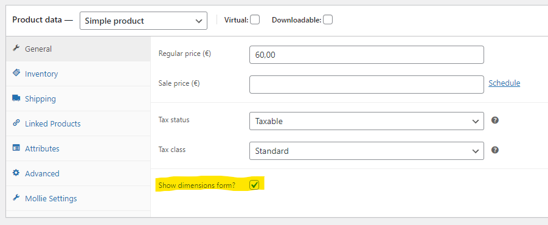

# 💐 WooCommerce dimensions calculator

This plugin adds a *dimensions* calculator underneath the *quantity* input. 
It allows a customer to calculate the amount of products it needs for the 
given dimensions.

## 🔌 Installation

Download the code as a ZIP

Place the contents of the ZIP into the plugins folder.

Don't rename the folder name inside the ZIP file, this to prevent errors when an
update is available.

## 💾 Configuration

You can show the form by enabling the *Show dimensions form* 
from the `General` options tab in a WooCommerce product.

On the plugins settings page you can edit the `heading` of the form 
and the form field `labels`.

The settings page is stored under `wp admin -> settings -> Woo calculator`